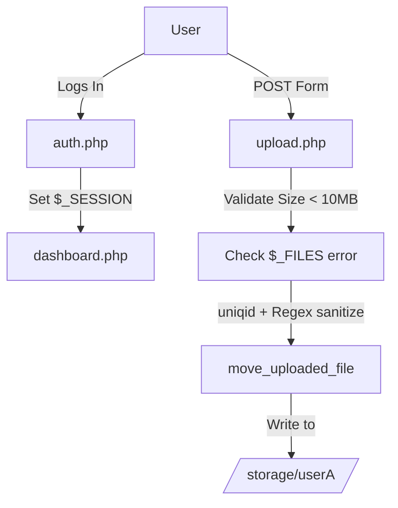

# Developer & Technical Documentation

This document provides a technical guide to the **FIleDownloader-Uploader** application's architecture and execution.

---

## System Architecture

The system is a classic Multi-Page Application (MPA) running on pure PHP, relying on `$_SESSION` for state and superglobals like `$_FILES` for input handling.



---

## Directory Structure & File Roles

```
.
├── includes/auth.php     # Session handling and login verification logic
├── includes/config.php   # General configurations
├── public/               # Web-facing endpoints (index.php, dashboard.php, upload.php, download.php)
├── storage/              # Dynamically generated user directories containing .txt/files
├── README.md             # General overview
└── Documentation.md      # Technical documentation
```

---

## Workflow

The execution flow of FIleDownloader-Uploader:
1. **Initialization**: User visits `index.php`. `auth.php` initiates a PHP session. 
2. **Upload Process**: `upload.php` catches the `POST` request. It defines `$storagePath` using `__DIR__ . "/../storage/" . $_SESSION['user']`.
3. **Validation**: Script checks that `$_FILES['error'] === 0` and that the file size does not exceed `10 * 1024 * 1024` (10MB).
4. **Sanitization**: `$originalName` is fetched via `basename`. It undergoes a `preg_replace` stripping out irregular characters and is concatenated with a `uniqid()` prefix.
5. **Disk Write**: `move_uploaded_file` transfers the `tmp_name` to the secure `storage/` directory and redirects the user back to the dashboard.

---

## Launcher Compilation Guide

If you need to run the application, utilize the built-in PHP development server.

### Compilation or Execution Commands

Execute the following commands in order within your terminal:

```powershell
# Navigate to the public folder
cd public

# Start the PHP development server
php -S localhost:8000

# Access the app at http://localhost:8000
```
